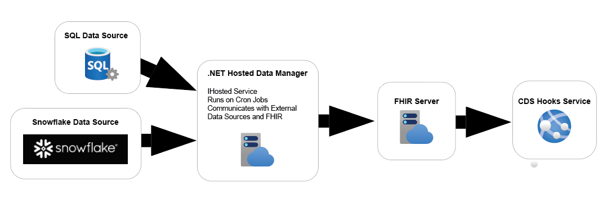
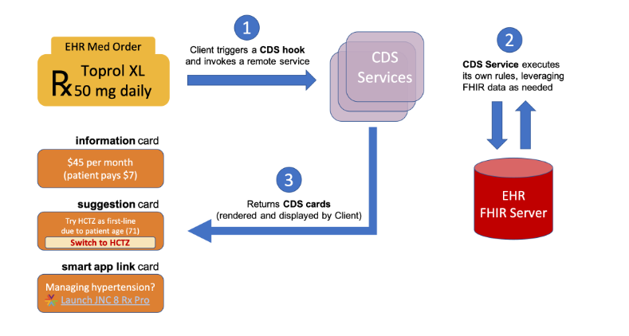

# Healthcare 2.0
This is a project that is focused on data transformation within the health care industry. The project was inspired by a desire to automate the data ingestion and use of health care data via the Fast Helath Interoperability Resources 

# Project Architecture
The project is architected using the following components.

- .Net Hosted Service that is required to run Extract Transform and Load Jobs from defined external data sources.
- A HAPI FHIR Server that serves as a repository for transformed data to FHIR resource format.
- A Clinical Decision Support Hooks REST service to surface requests in the EHR

# Project Developer Set-up Guide

## .Net Hosted Data Manager
The ingress data source can be any ingress data source. Available ingress data socurces inlude
- SQL database
- Oracle database
- Snowflake database
  
The following example shows the use of a SQL Data source in setting up the data source. 

- Navigate to the Fhir.DataManager project and open the appsettings.json
- Modify the appsettings.json ConnectionString:DataConnection entry to match your datasourxe
```json
  "ConnectionStrings": {
    "DataConnection": "Server=tcp:localhost,1403;Database=<database-name>;User Id=sa;Password=<password>; Integrated Security=false; Encrypt=false"
  }
```
- Create a new DataJob under the jobs folder in Fhir.DataManager project. the following is a defined job example to load patients
- Logic to perform all the neccesary ETL processes are developed in the job 
  
  ```c#
    public class PatientLoaderJob : CronJobService	{
		private readonly ILogger<PatientLoaderJob> _logger;
		private readonly IFhirDataService _fhirDataService;
		private readonly IRepository _repository;

		public PatientLoaderJob(IScheduleConfig<PatientLoaderJob> configuration, ILogger<PatientLoaderJob> logger, IFhirDataService fhirDataService, IRepository repository) : base(configuration.CronExpression, configuration.TimeZoneInfo)
		{
			_logger = logger;
			_fhirDataService = fhirDataService;
			_repository = repository;
		}

		public override Task StartAsync(CancellationToken cancellationToken)
		{
			_logger.LogInformation($"{nameof(PatientLoaderJob)} started {DateTime.UtcNow.ToShortDateString()}.");
			return base.StartAsync(cancellationToken);
		}

		public override async Task ExecuteAsync(CancellationToken cancellationToken)
		{
			_logger.LogInformation($"{DateTime.Now:hh:mm:ss} {nameof(PatientLoaderJob)} executing new data load process.");
			await LoadSourceDataAsync(cancellationToken);
		}

		public override Task StopAsync(CancellationToken cancellationToken)
		{
			_logger.LogInformation($"{nameof(PatientLoaderJob)} is stopping.");
			return base.StopAsync(cancellationToken);
		}

		public async Task LoadSourceDataAsync(CancellationToken cancellationToken)
		{
			_logger.LogInformation("Starting Data Loading Process");

			_logger.LogInformation($"---Loading data from source ---");

			var query = "select * from externalpatient table";

			var sourceData = await _repository.Get(query, DataSources.SqlDataSource.ToString());

			_logger.LogInformation($"---Transforming data from source---");

			await PrintOutput(sourceData);

			_logger.LogInformation($"---Loading transformed data  from source  into FHIR server---");

			await Task.CompletedTask;

		}

		private async Task PrintOutput(IEnumerable<dynamic> data)
		{
			foreach (var item in data)
			{
				var displaydata = new
				{
					Id = item.Id,
					Name = item.Name,
					Gender = item.Gender,
					DOB = item.DateOfBirth,
				};

				Console.WriteLine(JsonConvert.SerializeObject(displaydata, Formatting.Indented));

			}
		}
	}

``
- Add the newly created job to the Program file as shown below
- The job is scheduled to run based on the cron expression defined

```c#
	public class Program  	{
		public static void Main(string[] args)
		{
			IHost host = Host.CreateDefaultBuilder(args)
				.ConfigureServices(services =>
				{
					services.AddScoped<IScopedService, ScopedService>();
					services.AddSingleton<DataContext>();
					services.AddSingleton<IFhirDataService, FhirDataService>();
					services.AddSingleton<IRepository, Repository>();
					services.AddCronJob<PatientLoaderJob>(c =>
					{
						c.TimeZoneInfo = TimeZoneInfo.Local;
						c.CronExpression = @"*/1 * * * *";
					});
				})
				.Build();

			host.Run();
		}
	}
```

## HAPI FHIR Server
You will need a local instance of the HAPI FHIR Server. You can run this via docker using the following commands
```bash
docker pull hapiproject/hapi:latest
docker run -p 8080:8080 hapiproject/hapi:latest
```
This will run the docker image with the default configuration, mapping port 8080 from the container to port 8080 in the host. Once running, you can access http://localhost:8080/ in the browser to access the HAPI FHIR server's UI or use http://localhost:8080/fhir/ as the base URL for your REST requests.

#### Connecting the HAPI FHIR server to The Data manager
- Navigate to the Fhir.DataManager project and open the appsettings.json
- Modify the appsettings.json ConnectionString:DataConnection entry to match your datasourxe
```json
  "FhirServer": {
    "Url": "http://localhost:8080/fhir/"
  },
```

## Clinical Decision Support Hooks Service
Clinical Decision Support (CDS) Hooks is a Health Level Seven International® (HL7®) specification managed by the HL7 Clinical Decision Support (CDS) Workgroup that provides a way to embed additional, near real-time functionality within a clinician’s workflow of an EHR. A specified event(s) within the clinician’s workflow triggers the CDS service which gathers the appropriate specified data elements through secure Fast Healthcare Interoperability Resources® (FHIR®) services. By utilizing FHIR services, CDS Hooks provides interoperability between multiple stakeholders operating on different platforms.

The CDS specification can be found here [CDS Documentation](https://cds-hooks.org/)

The Clinical Decision Support Hooks REST service  can return appropriate guidance such as proposed alternative medication or formulary information.

